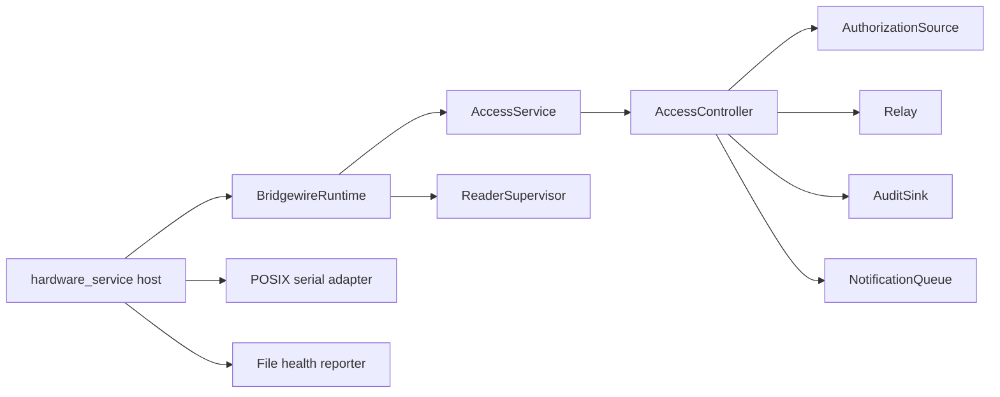

# Architecture refactor through Increment 3

This first review stops after runtime extraction and the application-service
boundary. FastAPI, status/query services, and broad domain/package relocation
are deliberately deferred.

## Baseline

The baseline test suite passed before refactoring. Existing tests characterize
authorized, denied, unknown, and malformed credentials; non-blocking release
and automatic restore; duplicate release behavior; reader disconnect and
recovery; fail-secure startup and shutdown; authorization validation and atomic
replacement; durable notification queuing; and repeated-invalid escalation.

The preserved CLI surface is:

```text
bridgewire version
bridgewire simulate [--config] [--schema] [--authorization]
bridgewire serve-simulated [--config] [--schema] [--authorization] [--interval]
bridgewire serve-hardware --config --schema --authorization --audit --notifications --health
```

## Resulting boundary



`BridgewireRuntime` owns cooperative event-loop behavior, controller ticks,
reader connection/reconnection, record submission, reader-event auditing, and
cooperative shutdown. It has no OS signal or filesystem serialization logic.

`AccessService` is the stable application boundary above `AccessController`.
It records credential origin explicitly, delegates every authorization and
relay decision to the controller, and returns an immutable serializable result.
It does not expose authorization-set contents or create a trusted bypass.

The hardware host remains responsible for dependency construction, signal
registration, guaranteed `finally` cleanup, and closing durable persistence.
The existing module continues to re-export POSIX reader names as compatibility
imports.

## Deferred

- Increment 4 status/read models
- Broader ports and adapters package relocation
- FastAPI and Uvicorn
- HTTP endpoints of any kind
- API configuration
- Remote unlock or lock
- Simulator migration to the extracted runtime
