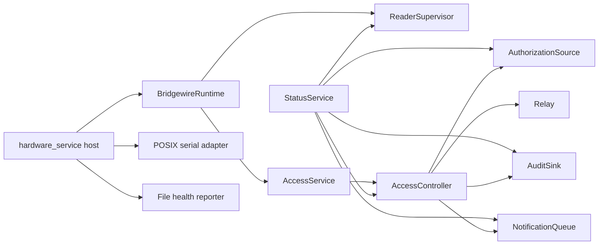

# Architecture refactor through Increment 4

Increment 4 adds a framework-independent status read model to the hardened
runtime and application-service boundary. FastAPI and broad domain/package
relocation remain deliberately deferred.

## Baseline

The baseline test suite passed before refactoring. Existing tests characterize
authorized, denied, unknown, and malformed credentials; non-blocking release
and automatic restore; duplicate release behavior; reader disconnect and
recovery; fail-secure startup and shutdown; authorization validation and atomic
replacement; durable notification queuing; and repeated-invalid escalation.

The preserved CLI surface is:

```text
bridgewire version
bridgewire simulate [--config] [--schema] [--authorization]
bridgewire serve-simulated [--config] [--schema] [--authorization] [--interval]
bridgewire serve-hardware --config --schema --authorization --audit --notifications --health
```

## Resulting boundary



`BridgewireRuntime` owns cooperative event-loop behavior, controller ticks,
reader connection/reconnection, record submission, reader-event auditing, and
cooperative shutdown. It has no OS signal or filesystem serialization logic.

`AccessService` is the stable application boundary above `AccessController`.
Every submission requires an explicit credential origin. Both framed reader
records and direct identifier submissions use the canonical reader credential
validator; malformed values therefore share the controller's audit, denial,
and escalation path. The immutable result separates `authorized`,
`authorization`, `malformed`, `controller_state`, `physical_release`,
`relay_actuation_requested`, `relay_actuation_succeeded`, and `source`.
Authorization does not imply successful physical release. No audit event ID is
reported because the current audit boundary does not return one.

`StatusService` builds an immutable, serializable point-in-time view using only
public snapshot methods and narrow query protocols. It reports controller and
reader state, release timing and the last relay command, credential-processing
and reader-record telemetry, authorization load metadata, the latest audit
time, pending notification count, an explicitly injected application start
time, and software version. The controller retains its monotonic deadline for
internal correctness; the public status contract exposes remaining seconds and
an estimated UTC `release_deadline_at`. It exposes no credential records,
filesystem paths, relay controls, or private implementation fields. It has no
FastAPI or Pydantic dependency.

The authorization `version` is a source-metadata revision derived from file
modification time and size. It is useful for change detection but is not a
content hash or cryptographic identity.

Before a concurrent HTTP adapter is introduced, operational status will move
to a runtime-published cached immutable snapshot. Audit/event reads will use
independent read-only persistence connections, and notification persistence
will receive an equivalent safe read boundary. FastAPI will not directly query
the runtime's SQLite connection or assemble live controller and reader state
across threads.

The hardware host remains responsible for dependency construction, signal
registration, guaranteed `finally` cleanup, and closing durable persistence. On
shutdown, the runtime attempts access/controller shutdown first (LOW and relay
cleanup), reader close second, and the stopped health report last. It retains
all failures in an exception group. The host then independently attempts relay
cleanup before closing SQLite, so reader, audit, or health failures cannot skip
the final hardware-owned safe-state attempt. A failed shutdown remains
retryable; a fully successful shutdown is idempotent.

The runtime owns the repeated `run_once()` loop and exposes only a readiness
callback to the host. Reconnect waits use an injectable synchronous waiter:
production waits are interruptible in 50 ms intervals and tick the controller;
tests advance `ManualClock` deterministically without sleeping.

## Blocking-operation policy

| Operation | Bound or expected duration | Failure and release-deadline policy |
| --- | --- | --- |
| Serial `select()` | 50 ms timeout | Empty reads return to the loop; ticking resumes immediately. |
| `udevadm` identity query | 0.5 s timeout per candidate | The candidate is skipped as unidentified; later runtime ticks still restore LOW. This is short enough for local discovery while allowing normal process startup overhead. |
| Reconnect backoff | Bounded by configured backoff; checked every 50 ms | Shutdown interrupts it and controller ticks continue throughout. |
| SQLite audit write (`synchronous=FULL`) | Intentionally synchronous; normally local-storage latency | Failure propagates and triggers fail-secure cleanup. It can delay a tick, so moving persistence off the control loop remains a later design option. |
| Health tempfile flush, `fsync()`, and atomic replace | Intentionally synchronous; normally local-storage latency | Failure is retained but cannot skip controller or final relay cleanup. Moving reporting off-loop may be reviewed later. |

Health JSON is an atomically replaced point-in-time report containing `status`,
UTC ISO-8601 `reported_at`, and state-specific details. File existence alone
does not prove that the process is healthy; consumers must consider report age
and systemd/process status.

`hardware_service` continues to re-export `PosixSerialSession` and
`enumerate_serial_devices` as supported compatibility imports through the
future API increment. The private `_serial_device_from_by_id` helper is not
advertised. These compatibility exports may be removed in the next major
release or an explicit cleanup increment.

## Process-exit fail-secure verification

The software guarantee is: once the process has initialized BCM23, every
cooperative or Python-level exit path independently attempts to drive it LOW
and clean it up before returning an error or exiting. Cleanup failures are
reported after all remaining cleanup attempts have run.

| Exit path | BCM23 outcome |
| --- | --- |
| Startup failure before relay initialization | GPIO is untouched by Bridgewire. |
| Startup failure after relay construction but before `setup()` | GPIO is untouched; the fallback cleanup is a safe no-op. |
| Startup failure during or after relay initialization | Host exception handling, runtime shutdown when available, and the final direct relay cleanup all run; LOW is attempted. |
| Reader discovery, open, read, disconnect, or record-processing exception | The runtime/controller safe-state path runs, followed by runtime shutdown and the host's direct LOW/cleanup fallback. |
| Audit append exception, including after relay assertion | The exception propagates, but fault handling and shutdown are independent of fault-health reporting; final direct relay cleanup still attempts LOW. |
| Fault or shutdown health-report exception | The failure is retained; access shutdown and final direct relay cleanup still run. |
| `ReaderSession.close()` exception | Access shutdown is attempted before reader close; final direct relay cleanup also runs. |
| `KeyboardInterrupt`, `SystemExit`, or another Python `BaseException` | The host catches it, runs the fail-secure sequence, then re-raises/reports retained failures. |
| SIGTERM or SIGINT handled by the installed signal handler | The stop event interrupts reconnect waiting, the runtime loop exits, and shutdown drives LOW. |
| Ordinary interpreter shutdown after the host is entered | Normal return and Python-level exceptions pass through the host `finally` block, which attempts LOW. |
| SIGKILL, power loss, native crash, `os._exit()`, or forced interpreter termination that bypasses `finally` | **Not software-guaranteed.** The process cannot execute cleanup. Electrical fail-safe behavior must come from the relay interface, pull resistors, and lock/relay wiring. |
| GPIO driver rejects the LOW command or hardware is disconnected/faulty | **Not physically guaranteed.** Bridgewire records/returns the failure and still attempts GPIO cleanup; software cannot prove the pin or relay changed state. |

SIGTERM is cooperative rather than instantaneous. The stop event is observed
within the 50 ms serial/reconnect polling intervals, but an in-progress
synchronous SQLite or filesystem operation must return or fail before Python
can finish the shutdown path. SIGKILL and physical hardware failure therefore
remain deployment-level risks, not conditions that application cleanup can
solve.

## Deferred

- Broader ports and adapters package relocation
- FastAPI and Uvicorn
- HTTP endpoints of any kind
- API configuration
- Remote unlock or lock
- Simulator migration to the extracted runtime
