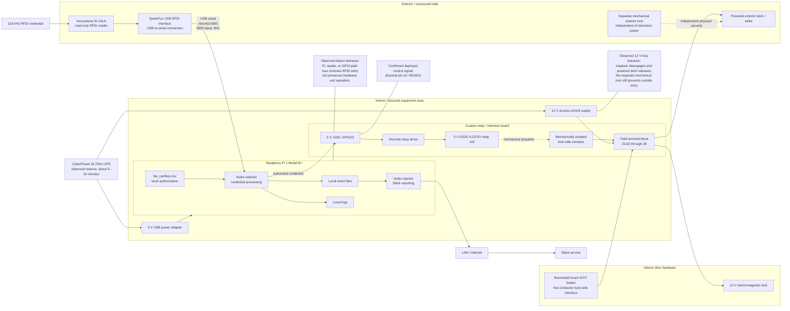

# Existing System Architecture

**System:** Bridgewire RFID access-control installation  
**Version:** 2.0  
**Updated:** 2026-07-24  
**Status:** Existing-system as-built baseline  
**Software baseline:** Preserved RP1 backup is treated as authoritative because the installed Pi is not logically accessible.

## Architecture diagram

## System description

The installation has three distinct functional layers:

1. **RFID entry layer:** reader → Pi → authorization software → GPIO23 → custom relay board.
2. **Independent exit layer:** exit button → lock-side circuitry. The Pi does not read the exit button.
3. **Independent mechanical security layer:** a separate physical exterior lock continues to prevent outside entry even when electronic lock power is lost.

The installation also contains two electrical domains:

- a **5 V Pi/control domain**, including the Pi, USB reader, and relay-driver circuitry;
- a **12 V lock domain**, including the exit button, electromagnetic lock, powered latch/strike, and terminal block.

The relay mechanically couples the domains. Accessible continuity testing did not establish a shared ground between the Pi/control domain and the 12 V lock domain.

## Confirmed interfaces

| Interface | Confirmed behavior |
|---|---|
| Reader to Pi | USB serial at `/dev/ttyUSB0`, 9600 baud; software uses PySerial defaults for 8N1 |
| Pi to custom board | 5 V, control ground, and physical pin 16 / BCM23 |
| GPIO command | Approximately 0 V after a completed cycle and approximately 3.3 V during the three-second release command |
| Relay coil | Approximately 5 V when active |
| Authorization | Local CSV with `KEY`, `NAME`, and `ALLOW`; access requires `ALLOW=y` |
| Exit button | No software input; hardware exit remains usable during Pi, reader, and GPIO-path failures |
| Backup power | UPS supplies both the Pi adapter and 12 V access-control supply for approximately 5–10 minutes |
| Mechanical lock | Independent of the electronic release system and remains the outside-entry barrier after electronic power loss |

## Observed failure behavior

| Failure | Observed result |
|---|---|
| Pi power lost | Exit button, maglock, and powered latch remain operational; RFID entry is unavailable |
| Reader disconnected | Exit button, maglock, and powered latch remain operational; RFID entry is unavailable |
| GPIO/control conductor lost | Reader and software continue operating, but authorized credentials do not actuate either electronic lock; exit remains available |
| 12 V access-control supply lost | Maglock disengages and powered latch releases; reader may still operate but cannot actuate the locks; separate mechanical lock prevents outside entry |
| Facility AC lost | UPS preserves normal operation for approximately 5–10 minutes; after electronic power is exhausted, the separate mechanical lock remains the outside-entry barrier |

## Architectural conclusions

- The reader is a credential source, not a lock controller.
- The Pi is required only for RFID-based entry.
- The exit path is independent of the Pi, reader, and GPIO actuation path.
- GPIO/control-path failure is fail-closed for RFID entry while preserving egress.
- Electronic lock power loss causes both electronic locking devices to de-energize.
- Continued exterior security after total electronic power loss depends on the separate mechanical lock.

## Remaining unknowns

- Exact component-level topology of the custom relay board.
- Exact contact usage of the DS2E relay.
- Exact electrical reason the connected exit-button harness is required for normal board operation.
- Exact startup transient while the Pi pin is first configured.
- Whether the inaccessible live Pi differs from the preserved backup; the backup is the accepted project baseline.
