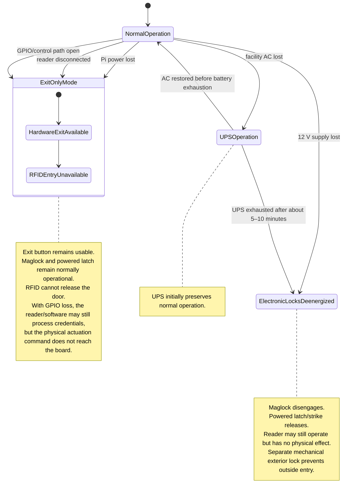

# Existing Credential-Processing and Failure-State Model

**System:** Original Raspberry Pi 1 access-control software and observed system-level failure behavior  
**Version:** 2.0  
**Updated:** 2026-07-24  
**Primary software source:** Read-only review of the preserved RP1 backup

## Credential-processing state machine

```mermaid
stateDiagram-v2
    [*] --> Booting

    Booting --> StartingWatcher: Linux and systemd start
    StartingWatcher --> InitializingGPIO: hodor-watcher begins

    InitializingGPIO --> OpeningSerial: BOARD mode; physical pin 16 OUTPUT
    note right of InitializingGPIO
        No explicit startup output value is supplied.
    end note

    OpeningSerial --> WaitingForCredential: /dev/ttyUSB0 opens
    OpeningSerial --> ProcessFailed: open exception

    WaitingForCredential --> WaitingForCredential: 1-second empty read
    WaitingForCredential --> ParsingCredential: complete line received
    WaitingForCredential --> ProcessFailed: serial exception
    WaitingForCredential --> ReaderSilent: device stays open but stops producing records

    ReaderSilent --> ReaderSilent: empty reads ignored indefinitely
    ReaderSilent --> Booting: manual reboot or external intervention

    ParsingCredential --> LoadingAuthorization: trim, uppercase, remove STX/ETX
    ParsingCredential --> ProcessFailed: malformed input triggers unhandled error
    LoadingAuthorization --> CheckingAuthorization: reopen and parse CSV

    CheckingAuthorization --> LoggingUnknown: no matching KEY
    CheckingAuthorization --> LoggingDenied: matching KEY; ALLOW not y
    CheckingAuthorization --> LoggingRecognized: matching KEY; ALLOW=y

    LoggingUnknown --> WaitingForCredential
    LoggingDenied --> WaitingForCredential
    LoggingRecognized --> LoggingGranted
    LoggingGranted --> GPIOHigh

    GPIOHigh --> UnlockDelay: physical pin 16 HIGH
    UnlockDelay --> GPIOLow: blocking sleep for about 3 seconds
    GPIOLow --> WaitingForCredential: physical pin 16 LOW

    note right of UnlockDelay
        The watcher does not read another credential
        while blocked in sleep(3).
    end note

    ProcessFailed --> Restarting: process exits
    Restarting --> OpeningSerial: systemd Restart=always
    Restarting --> RestartLimited: repeated rapid failures exceed start limit
    RestartLimited --> Booting: intervention or later restart

    GPIOHigh --> UnsafeTermination: process ends before LOW
    UnlockDelay --> UnsafeTermination: process ends before LOW
    UnsafeTermination --> Restarting

    note right of UnsafeTermination
        No finally block, signal handler,
        GPIO cleanup, or guaranteed LOW command exists.
    end note
```

## Observed system-level failure states

## Credential outcomes

### Authorized credential

The software normalizes the reader record, reloads the authorization CSV, matches the key, verifies `ALLOW=y`, writes recognized and granted events, then drives physical pin 16 HIGH for approximately three seconds before returning it LOW.

### Recognized but disallowed credential

The software writes recognized and denial events. It does not command GPIO.

### Unknown credential

The software writes an unrecognized-key event. It does not command GPIO.

## Hardware exit path

The exit button does not appear in the software. Observed failure testing establishes that the hardware exit path remains available during:

- Pi power loss;
- reader disconnection;
- GPIO/control-wire loss.

The exit-button assembly must remain connected for normal lock-side operation, but the exact internal circuit remains unresolved.

## Closed failure questions

- Pi failure removes RFID entry but does not remove egress.
- Reader failure removes RFID entry but does not remove egress.
- GPIO path failure allows reader/software operation but prevents physical release.
- 12 V loss de-energizes both electronic locking devices.
- Facility AC loss is initially masked by the UPS for approximately 5–10 minutes.
- After electronic power loss, exterior entry remains blocked by the separate mechanical lock.

## Migration implication

The replacement state machine should retain the observed safe operational outcomes while eliminating the blocking `sleep(3)`. Release timing should use an explicit deadline or asynchronous timer so the application can continue reading events, detecting reader health, logging activity, and escalating subsequent invalid credentials.
