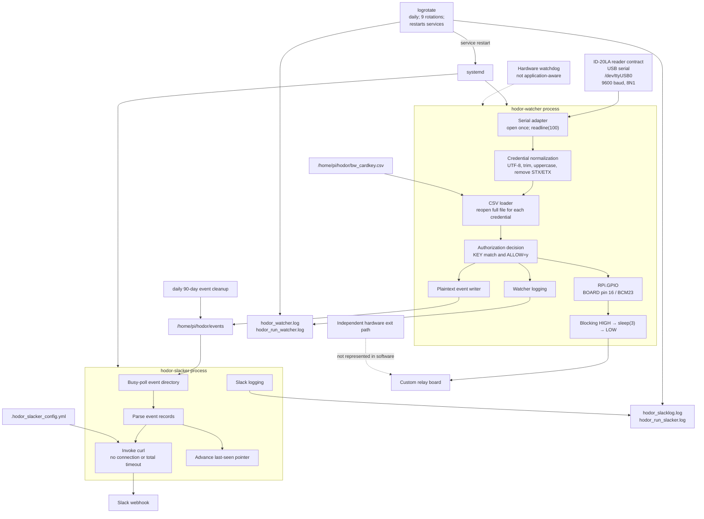

# Existing Software Architecture

**System:** Original RP1 Hodor access-control application  
**Version:** 2.0  
**Updated:** 2026-07-24  
**Runtime:** Python 3.7 on Raspberry Pi Linux  
**Authoritative baseline:** Preserved RP1 backup

## Software architecture diagram

## Process responsibilities

### `hodor-watcher`

The watcher:

- configures `RPi.GPIO` in BOARD mode;
- configures physical pin 16 as an output;
- opens `/dev/ttyUSB0` at 9600 baud with a one-second timeout;
- reads records with `readline(100)`;
- normalizes credential text;
- reloads the authorization CSV for each credential;
- writes recognized, granted, denied, and unknown events;
- executes a blocking three-second active-high GPIO pulse.

It has no in-process reconnect loop, reader rediscovery, health threshold, retry policy, backoff, signal handler, or exception-safe GPIO restoration.

### `hodor-slacker`

The Slack process polls the event directory and sends new events through `curl`. Local access decisions do not depend on Slack or network availability.

## Relationship between software and observed hardware failures

| Physical failure | Software behavior | Physical result |
|---|---|---|
| Pi loses power | All software stops | Exit remains usable; RFID entry unavailable |
| Reader disconnected | No usable credentials reach watcher; watcher may fail or remain ineffective depending on device behavior | Exit remains usable; RFID entry unavailable |
| GPIO conductor open | Reader and watcher can continue reading, authorizing, and logging | Authorized credentials have no effect on the locks |
| 12 V supply lost | Pi, reader, and watcher may continue operating | Electronic locks are de-energized; software commands have no physical effect |
| Facility AC lost | Software continues while UPS reserve remains | Normal operation for approximately 5–10 minutes |

## Key limitations

- Reader identity is tied to hard-coded `/dev/ttyUSB0`.
- Process existence is treated as a proxy for reader health.
- Empty reads are ignored indefinitely.
- No reader authentication or cryptographic credential validation exists.
- No checksum or fixed-length validation is performed.
- Blocking `sleep(3)` pauses credential processing.
- Abnormal termination does not guarantee GPIO LOW.
- Sensitive names, identifiers, and endpoint information may be exposed through logs and permissive filesystem modes.

## Baseline assumption

Because the live Pi cannot be inspected logically, the preserved backup is the accepted software starting point. Physical observations are used to validate externally visible behavior, but undocumented live-file differences are treated as unknowable rather than left as an open migration dependency.
