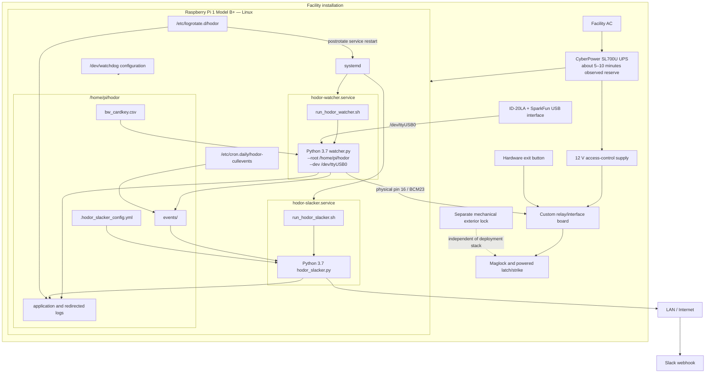

# Existing Deployment Model

**Target:** Raspberry Pi 1 Model B+ production installation  
**Version:** 2.0  
**Updated:** 2026-07-24  
**Baseline policy:** The preserved backup is treated as the deployed software baseline because the running Pi is physically accessible but not logically inspectable.

## Deployment diagram



## Services

| Property | `hodor-watcher.service` | `hodor-slacker.service` |
|---|---|---|
| User | `pi` | `pi` |
| Working directory | `/home/pi/hodor` | `/home/pi/hodor` |
| Dependency | `After=network.target` | `After=network.target` |
| Restart policy | `Restart=always` | `Restart=always` |
| Explicit `RestartSec` | None | None |
| Application-aware watchdog | None | None |

No alternative configured Hodor startup path was found in `rc.local`, system crontab, `/etc/cron.d`, or user cron spools.

## Watcher invocation

```text
python3 .../watcher.py --root /home/pi/hodor --dev /dev/ttyUSB0
```

The deployment therefore depends on one specific Linux device name and contains no udev alias, `/dev/serial/by-id` path, VID/PID selection, serial-number matching, or enumeration fallback.

## Logging and retention

Watcher:

- `/home/pi/hodor/log/hodor_watcher.log`
- `/home/pi/hodor/log/hodor_run_watcher.log`

Slack process:

- `hodor_slacklog.log`
- `hodor_run_slacker.log`

Logrotate runs daily, keeps nine rotations, and restarts the corresponding service. A daily cron job removes event records after approximately 90 days.

## Power and availability behavior

| Condition | Deployment outcome |
|---|---|
| Facility AC lost | UPS preserves Pi, reader, relay-board control power, and 12 V lock power for approximately 5–10 minutes |
| UPS exhausted | Electronic locks de-energize; separate mechanical lock still prevents outside entry |
| Pi offline | systemd and both Python services are unavailable; hardware exit remains functional |
| Reader disconnected | watcher cannot receive usable credentials; hardware exit remains functional |
| GPIO path open | software may continue running and logging, but no physical release occurs |
| 12 V supply offline | software may remain active, but lock actuation is unavailable |

## Deployment risks

1. A silent reader can leave a living but ineffective watcher.
2. USB re-enumeration can invalidate `/dev/ttyUSB0`.
3. Restart does not guarantee an explicit GPIO LOW.
4. Repeated rapid failures may trigger systemd start limiting.
5. Log rotation intentionally restarts services.
6. The Slack worker can busy-poll and block on curl.
7. No application-aware health signal proves that credentials can be read and the lock can be actuated.
8. UPS reserve is short and should not be treated as extended backup power.
