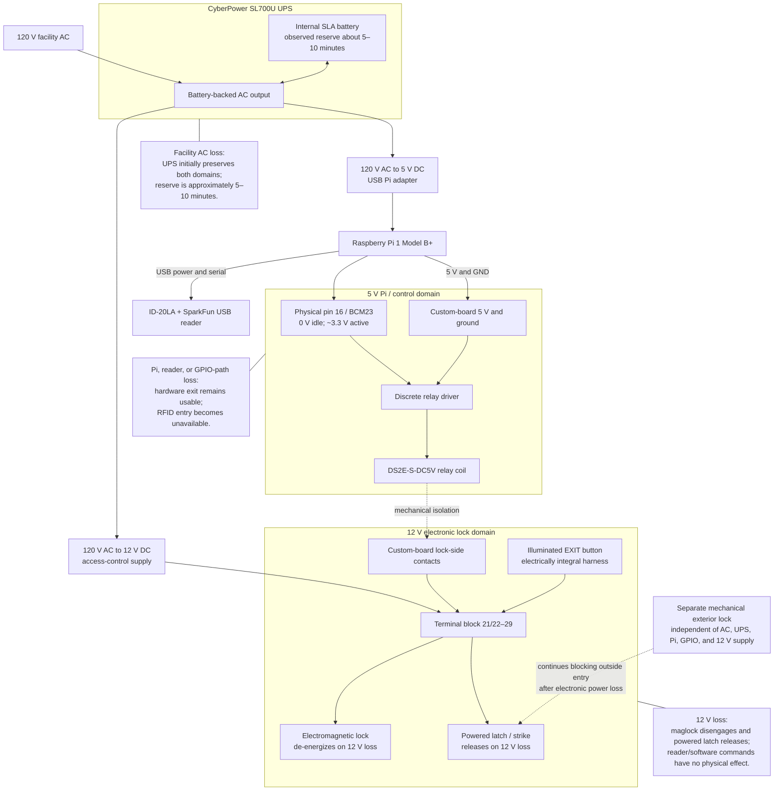

# Existing Power Distribution and Lock-Side Schematic

**Version:** 2.0  
**Updated:** 2026-07-24  
**Status:** Functional as-built schematic based on measurements, continuity, wiring inspection, and observed failure behavior

## Power and control diagram

## Confirmed distribution

- The UPS backs both the Pi power adapter and the 12 V access-control supply.
- The Pi powers the RFID reader over USB.
- The Pi supplies 5 V, ground, and GPIO23 to the custom board.
- The relay coil operates at approximately 5 V and is not driven directly by the 3.3 V GPIO.
- The relay mechanically separates the control and lock domains.
- The 12 V supply powers the electronic lock circuit and exit-button electronics.
- A separate mechanical exterior lock remains independent of all electronic power.

## Measured normal behavior

| Condition | GPIO23 | Relay side |
|---|---:|---:|
| Idle after completed access cycle | Approximately 0 V | Inactive |
| Authorized credential | Approximately 3.3 V for about three seconds | Approximately 5 V / active |
| End of release interval | Returns to approximately 0 V | Inactive |

## Observed power-failure behavior

| Power/control loss | Observed lock behavior | Entry/exit consequence |
|---|---|---|
| Pi power lost | Electronic locks and exit hardware remain otherwise operational | Exit available; RFID entry unavailable |
| Reader disconnected | No change to lock-side operation | Exit available; RFID entry unavailable |
| GPIO conductor lost | Lock-side system remains operational but cannot receive Pi release command | Exit available; credential may be read/logged but cannot release locks |
| 12 V supply lost | Maglock disengages; powered latch releases | Electronic access control is unavailable; separate mechanical lock prevents outside entry |
| Facility AC lost | UPS preserves operation for approximately 5–10 minutes | Normal operation continues during reserve; afterward electronic locks de-energize |
| UPS exhausted | Same electronic state as 12 V and Pi power loss | Separate mechanical lock remains the outside-entry barrier |

## Lock-side continuity findings

- Terminals 23, 24, 27, and 29 are on the measured +12 V node.
- Terminals 21/22 and 28 are on the measured return node.
- Terminals 25 and 26 measure approximately 0.1 ohm on the custom board.
- An approximately 54-ohm path from terminal 27 to terminals 25/26 appears through the connected exit-button assembly.
- Removing the exit-button harness prevents normal relay-board/lock operation.

These findings establish the functional role of the exit assembly but do not justify asserting a complete component-level schematic.

## Safety interpretation

The electronic maglock and powered latch behave as de-energize-to-release devices on 12 V loss. Exterior security during total electronic power loss is provided by the separate mechanical lock, not by the powered devices.
