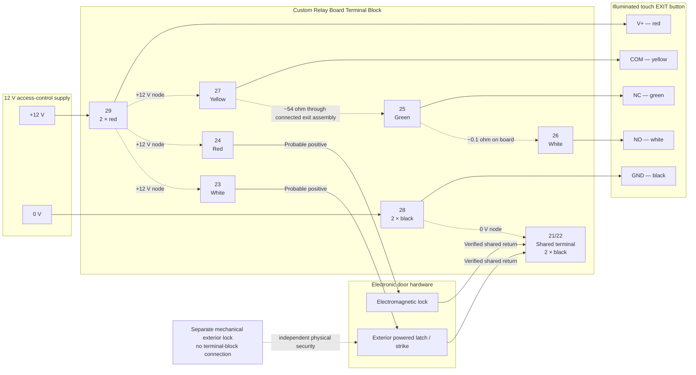

# Terminal Block Map and Cable Schedule

**Version:** 2.0  
**Updated:** 2026-07-24  
**Status:** Functional as-built map; no additional wire pulling is required

## Terminal-block diagram

## Terminal schedule

| Terminal | Conductors | Endpoint / device | Function | Status |
|---|---|---|---|---|
| 21/22 | Two black | Maglock and powered latch/strike returns | Shared 12 V return | Verified |
| 23 | One white | Exterior powered latch/strike | Probable positive feed | Probable |
| 24 | One red | Electromagnetic lock | Probable positive feed | Probable |
| 25 | One green | Exit button NC | Exit contact conductor | Verified by harness mapping |
| 26 | One white | Exit button NO | Exit contact conductor | Verified by harness mapping |
| 27 | One yellow | Exit button COM | On measured +12 V node | Verified |
| 28 | Two black | Supply negative and exit-button ground | 0 V distribution node | Verified |
| 29 | Two red | Supply positive and exit-button V+ | +12 V distribution node | Verified |

## Cable schedule

| Cable ID | Conductors | Endpoint A | Endpoint B | Assignment | Status |
|---|---|---|---|---|---|
| C-01 | 3 | Raspberry Pi GPIO header | Custom relay board | 5 V, control ground, physical pin 16 / BCM23 | Confirmed |
| C-02 | USB | Exterior reader assembly | Raspberry Pi USB | USB power and serial data | Confirmed |
| C-03 | 2 | Electromagnetic lock | Terminal block | Red to terminal 24 probable positive; black to 21/22 return | Functional map accepted |
| C-04 | 2 | Exterior powered latch/strike | Terminal block | White to terminal 23 probable positive; black to 21/22 return | Functional map accepted |
| C-05 | 5 | Illuminated EXIT button | Terminal block | Red→29, black→28, yellow→27, white→26, green→25 | Confirmed |
| C-06 | 2 | 12 V supply | Terminal block | Positive→29, negative→28 | Confirmed |
| C-07 | USB power | 5 V adapter | Raspberry Pi | 5 V DC and ground | Confirmed |
| C-08 | AC feeds | UPS | Pi adapter and 12 V supply | 120 V AC | Confirmed |

## Verified electrical relationships

| Measurement / observation | Result |
|---|---|
| Terminal 21/22 to terminal 28 | Same return node |
| Terminal 23 to terminal 29 | Same +12 V node |
| Terminal 24 to terminal 29 | Same +12 V node |
| Terminal 27 to terminal 29 | Same +12 V node |
| Terminal 25 to terminal 26 | Approximately 0.1 ohm on custom board |
| Terminal 27 to terminal 25/26 with exit harness connected | Approximately 54 ohms through exit assembly |
| Exit harness disconnected | Normal relay-board / lock operation is unavailable |
| 12 V supply lost | Maglock and powered latch/strike de-energize |
| Mechanical lock | No electrical connection; continues preventing outside entry |

## Documentation decision

The cable and terminal representation is sufficiently complete for migration planning. The remaining uncertainty around the exact positive assignment and internal board topology does not justify pulling conductors back through the building structure. Those items remain explicitly labeled rather than becoming dependencies for the replacement design.
