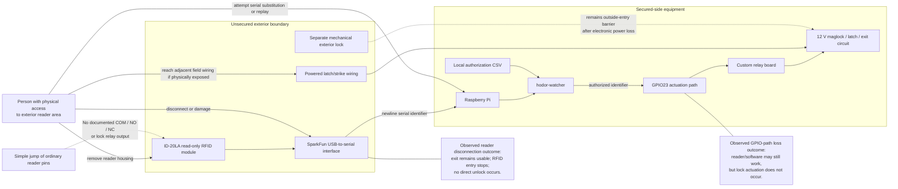

# Existing-System Security and Exterior Reader Threat Model

**Version:** 2.0  
**Updated:** 2026-07-24  
**Scope:** Exterior reader access, serial credential trust, field wiring, denial of service, electronic-lock failure, and independent mechanical security

## Threat-boundary diagram

## Principal conclusion

The documented reader assembly does not expose a standalone lock relay. A simple jump of ordinary reader pins is therefore not expected to release the door.

Observed reader disconnection supports that architecture:

- the exit button continues to work;
- the maglock and powered latch remain operational;
- RFID entry becomes unavailable;
- no direct release occurs merely because the reader is absent.

## Material risks

### Credential-data substitution or replay

The software trusts the serial identifier rather than authenticating the physical reader. It performs no cryptographic source authentication and no checksum or fixed-length enforcement. A substituted serial source presenting a valid authorized identifier could therefore be accepted.

### Reader denial of service

Removing, unplugging, damaging, or wedging the reader prevents RFID entry. The hardware exit path remains available, but the existing software provides weak detection and recovery for a reader that remains logically open while producing no records.

### Powered latch/strike wiring

The separate exterior latch/strike conductors belong to the 12 V lock-side system and are more consequential than the reader’s ordinary serial pins. Their physical exposure should be minimized.

### Exit-button circuit dependency

The connected exit-button harness is electrically required for normal lock-side operation. Physical disruption can cause loss of normal access-control function even though the exact internal path remains unresolved.

### Power failure and mechanical fallback

Loss of the 12 V supply causes the maglock to disengage and the powered latch to release. Exterior security after that point depends on the separate mechanical lock. This fallback is effective only while the mechanical lock is actually engaged and maintained.

### Credential cloning

The system authorizes a 125 kHz identifier rather than a cryptographic challenge-response credential. A copied authorized identifier may be accepted as the original.

## Risk summary

| Threat | Expected physical result | Residual risk |
|---|---|---|
| Jump ordinary reader pins | No documented direct-release path | Low for simple direct jump |
| Disconnect reader | RFID entry denied; exit preserved | High availability risk, low direct-release risk |
| Substitute serial source with valid identifier | Potential authorized release | High |
| Open GPIO/control conductor | Credential processing may continue; no release | Fail-closed for RFID entry |
| Lose Pi power | RFID entry denied; exit preserved | Availability risk |
| Lose 12 V power | Electronic locks de-energize | Exterior security depends on mechanical lock |
| Access latch/strike wiring | Outcome depends on field-circuit manipulation | Medium to high |
| Clone authorized credential | Identifier may be accepted | High |
| Compromise Slack/network | Does not directly control authorization | Lower direct-release risk; confidentiality/monitoring risk remains |

## Replacement requirements

1. Keep authorization and lock actuation inside the secured enclosure.
2. Treat every exterior device and conductor as untrusted.
3. Detect reader removal, serial silence, and identity changes.
4. Use a stable device identity rather than `/dev/ttyUSB0`.
5. Validate the documented reader record contract.
6. Escalate repeated invalid credentials and reader-health failures.
7. Preserve independent egress during Pi, reader, and GPIO failures.
8. Explicitly document mechanical-lock status as part of facility operating procedure.
9. Protect latch/strike conductors from access through the reader opening or shared cavity.
10. Avoid raw credential identifiers and personal names in routine external notifications.
