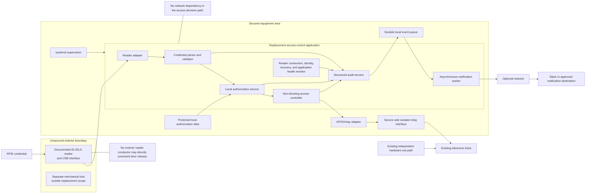

# Bridgewire Replacement Access-Control System Requirements and Acceptance Criteria

**Version:** 1.0  
**Status:** Approved implementation baseline  
**Date:** 2026-07-24  
**Project:** Bridgewire RP Project  
**System type:** Local RFID-controlled entry system with independent hardware egress  
**Existing-system software baseline:** Preserved Raspberry Pi 1 backup  
**Normative language:** **MUST**, **MUST NOT**, **SHOULD**, and **MAY** are used as requirements terms.

---

## 1. Purpose

This document defines the requirements and acceptance criteria for replacing the existing Raspberry Pi 1 access-control implementation with a maintainable, testable, recoverable system based on a Raspberry Pi 4 or equivalent supported target.

The replacement is intended to preserve the useful and safety-relevant behavior of the existing installation while correcting known software, deployment, security, observability, and recovery weaknesses.

This is a replacement-system contract. It is not a detailed implementation design, wiring instruction, or production cutover procedure.

---

## 2. Accepted project baseline

The following decisions are accepted for this phase:

1. The preserved Raspberry Pi 1 backup is the authoritative software starting point.
2. No further logical access to the installed Pi is required.
3. The manufacturer documentation for the ID-20LA reader and its USB interface is the reader contract.
4. The project will not pull existing field wiring back through the building to resolve minor remaining mapping uncertainty.
5. The current terminal-block and cable schedule is sufficiently complete for replacement planning.
6. The exact internal circuit of the existing exit button and custom relay board may remain unresolved where functional behavior is already established.
7. The replacement must preserve independent egress.
8. The replacement must be developed in a monorepo with simulated hardware support and automated testing.
9. Version 1 will retain the existing local authorization file and its current record structure.
10. Version 1 will validate that existing authorization file against a schema rather than redesigning credential records.
11. Integration with the agency's third-party membership application is deferred until that system's capabilities and integration requirements are documented.
12. No graphical credential-management interface is required for version 1.
13. The target runtime is Python 3.13 on Raspberry Pi OS Lite 64-bit based on Debian Trixie.
14. Poetry will manage project metadata, dependency resolution, and development environments.
15. Ruff will provide formatting and linting; mypy will provide static type checking; pytest and pytest-cov will provide automated testing and coverage.
16. GitHub Actions will provide continuous integration.
17. Python Semantic Release will manage product-level semantic versioning, changelog generation, Git tags, and GitHub releases.
18. Conventional Commits will be used for commit and pull-request titles that affect release calculation.
19. The product will use one repository-wide semantic version rather than independently versioning internal packages.
20. The approved GPIO contract is BCM numbering, BCM23 output, LOW normal state, HIGH release state, and a three-second release duration.
21. A second authorized credential received during an active release will be processed and audited but will not extend the original release deadline.
22. Reader health will cover detectable connection, identity, open, read, disconnect, reconnect, and ambiguity failures; passive silence without a documented heartbeat will be telemetry, not proof of reader failure.

---

## 3. Existing behavior that must be preserved

### 3.1 Authorized entry

An authorized credential causes the electronic entry system to release for approximately three seconds and then return to its normal secured state.

### 3.2 Local authorization

The access decision is made locally. Network access, Slack availability, or any external service must not be required to grant or deny access.

### 3.3 Independent exit

The exit button operates independently of:

- the Raspberry Pi;
- the RFID reader;
- the credential-processing process;
- the GPIO control conductor.

A failure of any of those components must not prevent egress.

### 3.4 Failure behavior

Observed existing-system behavior establishes the following replacement targets:

| Failure condition | Required replacement outcome |
|---|---|
| Pi/application failure | RFID entry unavailable; independent exit remains available |
| Reader disconnection | RFID entry unavailable; independent exit remains available |
| GPIO/control-path failure | Credential processing may continue, but no release occurs; independent exit remains available |
| Network or notification failure | Local entry and exit behavior remain unaffected |
| 12 V electronic-lock power loss | Electronic locks de-energize according to their hardware design |
| Total electronic power loss | Separate mechanical exterior lock remains outside the electronic system |

### 3.5 Reader contract

The replacement shall implement the documented ID-20LA/USB-interface contract rather than derive a new contract from ad hoc capture of the installed reader.

---

## 4. Target system context



---

## 5. Target application state model

```mermaid
stateDiagram-v2
    [*] --> Booting

    Booting --> Initializing
    Initializing --> Faulted: configuration or hardware initialization fails
    Initializing --> WaitingForReader: safe relay state established

    WaitingForReader --> Ready: reader connected and usable
    WaitingForReader --> Degraded: reader unavailable
    Degraded --> WaitingForReader: retry with backoff
    Degraded --> Ready: reader restored

    Ready --> Parsing: complete record received
    Ready --> Degraded: reader disconnect or health failure

    Parsing --> InvalidRecord: record violates reader contract
    Parsing --> Authorizing: record is valid

    InvalidRecord --> Auditing
    Authorizing --> Denied: known credential not allowed
    Authorizing --> Unknown: no credential match
    Authorizing --> Granting: allowed credential

    Denied --> Escalating: repeated invalid/denied activity crosses policy threshold
    Unknown --> Escalating: repeated invalid/unknown activity crosses policy threshold
    Denied --> Auditing
    Unknown --> Auditing
    Escalating --> Auditing

    Granting --> Released: relay asserted
    Released --> Ready: release deadline reached; relay restored
    Released --> Parsing: another record arrives during release

    Auditing --> Ready

    Faulted --> Initializing: supervised retry
    Released --> Faulted: unrecoverable controller error
    Faulted --> [*]: service stopped

    note right of Released
        Unlock timing is non-blocking.
        Reader, health, audit, and escalation work continue.
    end note

    note right of Faulted
        The controller must attempt to command the safe relay state
        before exit whenever the process is still capable of doing so.
    end note
```



---

## 6. Functional requirements

### FR-001 — Local access decisions

The system **MUST** make authorization decisions using protected local data.

The system **MUST NOT** require network connectivity, Slack, cloud storage, or another remote service to authorize a credential.

### FR-002 — Reader interface

The system **MUST** implement a reader adapter conforming to the documented reader and USB-interface contract.

Reader-specific framing, normalization, expected record shape, and checksum handling, where documented, **MUST** be represented in source-controlled tests and fixtures.

### FR-003 — Stable reader identity

The production deployment **MUST NOT** depend solely on `/dev/ttyUSB0`.

The reader **MUST** be selected using a stable identity. The preferred selection order is:

1. a configured `/dev/serial/by-id` path or equivalent udev alias;
2. expected VID, PID, and USB serial number;
3. expected VID/PID plus documented product and manufacturer attributes where no unique serial number exists.

If no expected reader is found, the application **MUST** report `READER_NOT_FOUND`.

If more than one device matches the configured identity, the application **MUST** report `READER_IDENTITY_AMBIGUOUS` and **MUST NOT** choose one arbitrarily.

Unrelated serial devices **MUST NOT** be classified as a reader identity failure merely because they are present. They may be included as redacted diagnostic context.

### FR-004 — Credential normalization

Credential normalization **MUST** be deterministic and documented.

Reader records **MUST** be decoded strictly. Invalid encoding **MUST** produce a malformed-record event and **MUST NOT** be silently ignored, repaired, or passed to authorization.

The system **MUST NOT** silently reinterpret malformed records as valid credentials.

### FR-005 — Authorization outcomes

The system **MUST** distinguish at least:

- authorized credential;
- known but disallowed credential;
- unknown credential;
- malformed reader record;
- reader or transport failure.

### FR-006 — Release duration

The default electronic release duration **MUST** be three seconds unless changed through an approved configuration revision.

The duration **MUST** be externalized as validated configuration rather than hard-coded in the credential-processing path.

### FR-007 — Non-blocking release

The release interval **MUST NOT** use a blocking `sleep(3)` or equivalent operation in the credential-processing path.

During an active release, the system **MUST** continue to:

- read reader events;
- classify additional credentials;
- record audit events;
- monitor reader health;
- process shutdown requests;
- maintain its release deadline.

### FR-008 — Additional credentials during release

A credential received during an active release **MUST** be parsed, classified, and audited.

The system **MUST NOT** silently discard or forget an authorized, denied, unknown, or malformed credential merely because the door is already released.

A second authorized credential **MUST NOT** extend or restart the original three-second release deadline in version 1.

### FR-009 — Invalid-credential escalation

Denied, unknown, and malformed credential events **MUST** be recorded individually.

Version 1 **MUST** implement the following configurable default escalation policy:

- three suspicious credential events within 60 seconds produce a warning escalation;
- five suspicious credential events within five minutes produce a critical escalation and queue an asynchronous notification;
- the escalation state resets after 15 minutes without another suspicious credential event.

The implementation **MUST** define the included event types, rolling-window behavior, severity, notification action, and reset semantics in source-controlled configuration and tests.

Escalation **MUST NOT** block reader processing, authorization, relay timing, or local audit persistence.

### FR-010 — Reader disconnect and reconnect recovery

The application **MUST** detect:

- expected reader absence;
- identity ambiguity;
- serial open failure;
- serial read failure;
- OS-detected USB disconnect;
- repeated reconnect failure;
- successful recovery.

It **MUST** retry connection without requiring a Pi reboot.

Retries **MUST** use bounded exponential backoff with optional jitter and **MUST NOT** create a tight failure loop.

Reconnect waiting **MUST** be interruptible so service shutdown does not wait for a full backoff interval.

The reader-owning component **MUST** emit typed state events rather than directly deciding notification policy.

### FR-011 — Reader-health boundaries

The health model **MUST NOT** rely only on process existence.

The application **MUST** report detectable reader and transport failures described in FR-010.

Because the documented passive reader provides no periodic heartbeat, version 1 **MUST NOT** claim that it can distinguish a healthy idle reader from a connected reader that silently stops producing tags.

The application **SHOULD** expose telemetry such as:

- current reader connection state;
- current matched device identity;
- time of last successfully parsed reader record;
- age of the last reader record;
- reconnect-attempt count;
- current backoff interval.

An unusually old `last_record_age` **MAY** be surfaced for operator awareness, but it **MUST NOT** by itself be classified as a confirmed reader failure or trigger automatic reconnect.

### FR-012 — Safe startup

Before accepting credentials, the application **MUST** explicitly establish the configured normal relay state.

The application **MUST NOT** rely on an unspecified GPIO state produced by process startup.

### FR-013 — Safe shutdown

On graceful shutdown, the application **MUST** explicitly command the configured normal relay state before releasing GPIO resources.

Shutdown handling **MUST** cover at least:

- `SIGTERM`;
- `SIGINT`;
- normal service stop;
- controlled application restart.

### FR-014 — Exception-safe relay control

Relay assertion and restoration **MUST** be protected so that recoverable application exceptions do not bypass the normal-state command.

No software requirement can guarantee behavior after loss of electrical power or `SIGKILL`, but the implementation **MUST** minimize the interval in which the last commanded state is uncertain.

### FR-015 — Independent exit path

The replacement software **MUST NOT** assume control of the existing hardware exit button.

The migration **MUST** preserve the independent exit circuit.

### FR-016 — Authorization-data format and administrative update workflow

Version 1 **MUST** continue using the existing local authorization file and its current record structure.

A schema **MUST** be created to validate the authorization file as it exists today. Version 1 **MUST NOT** require a redesigned credential-record format.

Before deployment or installation, each candidate authorization file **MUST** be validated against the schema.

An invalid or malformed candidate file **MUST** be rejected and **MUST NOT** replace either:

- the installed working authorization file; or
- the last valid authorization set already loaded by the application.

Installation **MUST** be atomic so the live system never reads a partially written authorization file.

The installation process **MUST** preserve the last working authorization file until the replacement file has passed validation and has been installed successfully.

Version 1 **MUST NOT** include integration with the agency's third-party membership application.

The following are explicitly deferred until the external system's capabilities and integration requirements are documented:

- new credential fields;
- automated synchronization;
- a redesigned administrative workflow;
- graphical or web-based credential administration;
- automated disabling or removal of credentials;
- expanded audit requirements associated with external synchronization.

No graphical credential-management interface is required for version 1.

### FR-017 — No notification dependency

Event notification **MUST** be asynchronous to credential processing.

Failure or delay of a notification endpoint **MUST NOT** delay a grant, denial, GPIO restoration, reader reconnect, or health check.

### FR-018 — Durable audit queue

Events awaiting external notification **MUST** be stored durably enough to survive process restart.

Delivery **MUST** support retry without silently advancing past a failed event.

Duplicate delivery **SHOULD** be prevented or made harmless through event identifiers and idempotent handling.

### FR-019 — Hardware abstraction

Reader, GPIO, clock/timer, authorization storage, audit storage, and notification delivery **MUST** be accessed through replaceable interfaces.

The core state machine **MUST** be testable without Raspberry Pi hardware.

### FR-020 — Simulation support

The monorepo **MUST** provide simulators or fakes for:

- serial reader input;
- GPIO/relay output;
- time and release deadlines;
- authorization data;
- notification success, delay, and failure;
- reader disconnect and silent-reader conditions.

---

## 7. Safety and hardware-interface requirements

### HW-001 — Secure-side actuation

The relay or other lock-actuation interface **MUST** remain inside the secured equipment area.

No ordinary exterior reader conductor **MUST** directly command door release.

### HW-002 — No direct lock drive from GPIO

A Raspberry Pi GPIO pin **MUST NOT** directly drive a relay coil, maglock, latch, or other inductive lock load.

The replacement **MUST** use an appropriate isolated or buffered interface.

### HW-003 — Approved GPIO contract

Version 1 **MUST** use the following logical contract:

| Property | Required value |
|---|---|
| Numbering scheme | BCM |
| Output channel | BCM23 |
| Normal state | LOW |
| Release state | HIGH |
| Default release duration | Three seconds |
| Startup | Explicitly command LOW before accepting credentials |
| Graceful shutdown | Explicitly command LOW before releasing GPIO resources |
| Electrical interface | Buffered or isolated; GPIO never directly drives an inductive load |

The selected relay/interface hardware **MUST** satisfy this contract or an approved requirements revision must be issued before production deployment.

### HW-004 — Exit preservation

Installation work **MUST NOT** interrupt or subordinate the independent exit path to the replacement application.

### HW-005 — Failure outcome

Loss of the Pi, reader, or GPIO command path **MUST NOT** create an unauthorized electronic release.

### HW-006 — Mechanical-lock boundary

The separate mechanical exterior lock is outside software control.

Its use, engagement, key control, and maintenance are operational responsibilities and **MUST** be documented separately from application state.

### HW-007 — UPS documentation

The deployed UPS configuration and expected runtime **MUST** be documented during cutover.

The current observed runtime of approximately 5–10 minutes is a baseline observation, not a guaranteed replacement runtime.

---

## 8. Security requirements

### SEC-001 — Credential confidentiality

Raw credential identifiers **MUST NOT** appear in routine logs, Slack messages, terminal output, health events, or ordinary operator notifications.

Reader adapters **MUST NOT** log the decoded tag value. Where correlation is required, the system **MAY** use an approved non-reversible fingerprint or event identifier.

### SEC-002 — Personal information

Cardholder names **MUST NOT** be included in external notifications unless explicitly approved for a defined operational need.

### SEC-003 — Protected authorization data

Authorization files and configuration **MUST** be readable only by the service account and explicitly authorized administrators.

World-writable or world-readable authorization and event directories are prohibited.

### SEC-004 — Secret handling

Webhook URLs, API tokens, SSH private keys, and comparable secrets **MUST NOT** be embedded in source code or printed to logs.

### SEC-005 — Least privilege

The service **MUST** run with the minimum Linux permissions required for:

- reader access;
- configured GPIO access;
- local authorization data;
- event storage.

### SEC-006 — Tamper and health events

Reader removal, repeated reconnect failure, stable-identity mismatch, malformed record bursts, and persistent health degradation **MUST** produce auditable events.

### SEC-007 — Audit identifiers

Audit events **MUST** include stable event IDs and enough non-sensitive context to support investigation without exposing raw credentials.

### SEC-008 — Input validation

All reader data and configuration inputs **MUST** be length-bounded and validated before use.

---

## 9. Reliability and performance requirements

### REL-001 — Continuous event loop

No routine access-control action **MUST** block the main control loop for the full release duration or for unbounded network/file operations.

### REL-002 — Bounded resource use

Polling, retry, event retention, logs, and notification queues **MUST** have bounded or managed resource behavior.

Busy loops are prohibited.

### REL-003 — Supervision

The production service **MUST** be supervised by systemd or an approved equivalent.

The service unit **MUST** define explicit restart delay and start-limit behavior.

### REL-004 — Application-aware health

The deployment **MUST** expose an application-aware health signal covering at least:

- process responsiveness;
- expected-reader presence and identity state;
- serial open/read/reconnect state;
- time and age of the last successfully parsed record as telemetry;
- authorization-data validity;
- relay-controller availability;
- notification backlog status.

The health signal **MUST** distinguish confirmed failures from passive-reader inactivity that cannot be conclusively classified.

### REL-005 — Watchdog integration

Where systemd watchdog support is used, the application **MUST NOT** report healthy merely because its process is alive.

### REL-006 — Restart recovery

After process restart, the application **MUST**:

1. validate configuration;
2. command the normal relay state;
3. restore or reload the last valid authorization data;
4. recover durable undelivered audit events;
5. reconnect to the reader;
6. report degraded state until required components are usable.

### REL-007 — Network isolation

Extended notification-endpoint failure **MUST NOT** degrade local access decisions or relay timing.

---

## 10. Observability requirements

### OBS-001 — Structured logs

Operational logs **MUST** use structured records or another consistently machine-parseable format.

### OBS-002 — Event taxonomy

The system **MUST** define event types for at least:

- service startup;
- service shutdown;
- configuration error;
- reader connecting;
- reader connected;
- expected reader not found;
- reader identity ambiguous;
- reader open failed;
- reader read failed or disconnected;
- reader reconnect scheduled;
- repeated reconnect failure;
- reader recovered;
- last-record-age telemetry without claiming confirmed failure;
- malformed record;
- credential authorized;
- credential denied;
- credential unknown;
- escalation threshold reached;
- relay asserted;
- relay restored;
- relay-control error;
- authorization-data reload;
- notification delivery failure;
- notification backlog recovery.

### OBS-003 — Severity

Events **MUST** carry a severity appropriate to their operational meaning.

Repeated invalid credentials **MUST** be capable of escalating beyond ordinary informational logging.

### OBS-004 — Timestamps

Audit and operational events **MUST** use consistent timestamps with explicit timezone handling.

### OBS-005 — Retention

Log, audit, and notification-queue retention **MUST** be configurable and documented.

Retention failure **MUST NOT** allow unbounded disk growth.

---

## 11. Configuration requirements

The following values **MUST** be externalized and validated:

- stable reader identity/path;
- serial parameters;
- expected record contract;
- GPIO numbering scheme;
- GPIO channel;
- normal and release polarity;
- release duration;
- reader reconnect delay and backoff;
- silent-reader health threshold;
- authorization-data location;
- event and log locations;
- retention settings;
- invalid-credential escalation policy, defaulting to 3 events/60 seconds for warning, 5 events/5 minutes for critical, and 15 minutes quiet for reset;
- notification endpoint reference;
- systemd watchdog interval, if used;
- reader identity attributes and ambiguity policy;
- reconnect backoff minimum, maximum, and jitter;
- approved GPIO contract values.

Configuration errors **MUST** fail clearly and **MUST NOT** result in an ambiguous relay state.

---

## 12. Development and repository requirements

### DEV-001 — Monorepo

Application code, simulators, deployment files, tests, schemas, documentation, and migration tooling **MUST** reside in one version-controlled monorepo.

The initial top-level structure **SHOULD** be:

```text
bridgewire/
├── apps/
│   ├── access-controller/
│   └── notifier/
├── packages/
│   ├── reader/
│   ├── authorization/
│   ├── access-state-machine/
│   ├── gpio/
│   ├── audit/
│   └── configuration/
├── simulators/
│   ├── reader/
│   ├── gpio/
│   └── notification-endpoint/
├── schemas/
│   └── authorization-file/
├── deployment/
│   ├── systemd/
│   ├── raspberry-pi/
│   └── scripts/
├── tests/
│   ├── integration/
│   ├── failure-modes/
│   └── hardware-in-the-loop/
└── docs/
```

### DEV-002 — Runtime and dependency management

The target Python constraint **MUST** be:

```toml
requires-python = ">=3.13,<3.14"
```

Poetry **MUST** manage project metadata, dependency resolution, lock files, and development environments.

Production deployment **SHOULD** install a built wheel into a dedicated application virtual environment; Poetry itself need not be installed on the production Pi.

### DEV-003 — Approved development tools

The repository **MUST** use:

- Ruff for formatting and linting;
- mypy for static type checking;
- pytest for unit and integration testing;
- pytest-cov for coverage reporting;
- GitHub Actions for CI;
- Python Semantic Release for semantic versioning and releases.

Ruff **MUST** declare `target-version = "py313"`.

Mypy **SHOULD** begin in strict mode for production packages. Any exceptions for incompletely typed hardware libraries must be narrow, documented, and reviewed.

### DEV-004 — Test-first implementation

Production behavior **MUST** be developed from executable tests for the intended contract.

Exploratory spikes, including the proposed threaded serial-health monitor, **MAY** be retained as design input but **MUST NOT** be merged as production implementation without corresponding contract tests, typed interfaces, privacy controls, shutdown behavior, and failure-state handling.

### DEV-005 — Test layers

The repository **MUST** include:

- unit tests;
- state-machine tests;
- parser boundary and malformed-input tests;
- escalation-window tests using a controllable clock;
- integration tests using simulated serial and GPIO;
- reconnect and device-identity tests;
- deployment tests for systemd and configuration;
- hardware-in-the-loop tests before production cutover.

### DEV-006 — Required CI checks

Pull requests and protected-branch builds **MUST** run:

```bash
poetry run ruff format --check .
poetry run ruff check .
poetry run mypy .
poetry run pytest --cov --cov-report=term-missing
poetry build
```

CI **MUST** also validate:

- the authorization-file schema and sanitized fixtures;
- configuration files;
- absence of committed production secrets;
- dependency vulnerabilities using an approved scanner.

### DEV-007 — Semantic versioning

The repository **MUST** use one product-level semantic version:

- development releases use `0.x.y`;
- the first accepted production release is `1.0.0`;
- Git tags use `vMAJOR.MINOR.PATCH`.

Commit and pull-request titles that affect release calculation **MUST** follow Conventional Commits.

Python Semantic Release **MUST** calculate the next version, update version metadata and changelog, create the Git tag, and publish the GitHub release only after ordinary CI succeeds on the protected main branch.

Pull-request workflows **MUST NOT** publish releases.

### DEV-008 — No production secrets

Test fixtures and repository history **MUST NOT** contain production card identifiers, cardholder names, webhook URLs, private keys, or other production secrets.

## 13. Deployment requirements

### DEP-000 — Target platform

The version 1 production target is Raspberry Pi OS Lite 64-bit based on Debian Trixie with Python 3.13.

The application **MUST** run from a dedicated virtual environment and **MUST NOT** require modification of the OS-managed Python environment.

### DEP-001 — Explicit systemd behavior

The production unit **MUST** define:

- service user;
- working directory;
- environment/configuration source;
- restart policy;
- restart delay;
- start-limit policy;
- shutdown timeout;
- signal handling;
- watchdog behavior, if enabled;
- log destination.

### DEP-002 — Stable device permissions

Reader and GPIO permissions **MUST** be established through documented OS configuration rather than broad filesystem permissions or interactive administrator steps.

### DEP-003 — Versioned release

Every production deployment **MUST** identify:

- application version;
- configuration version;
- authorization-data version or checksum;
- deployment timestamp;
- rollback target.

### DEP-004 — Rollback

A documented and tested rollback procedure **MUST** exist before production cutover.

### DEP-005 — Cutover safety

Production cutover **MUST** include:

- a physically available exit path;
- a person stationed at the door;
- confirmed mechanical-lock access;
- a tested rollback path;
- pre-cutover backup of configuration and authorization data;
- post-cutover functional tests.

---

## 14. Acceptance criteria

### AC-001 — Safe boot

**Given** the service starts with the relay interface available,  
**when** initialization begins,  
**then** the configured normal relay state is explicitly commanded before credentials are accepted.

### AC-002 — Authorized credential

**Given** a valid authorized credential,  
**when** its complete record is received,  
**then** an authorized event is recorded, the relay is asserted, and the relay returns to the normal state after the configured release duration.

### AC-003 — Known denied credential

**Given** a valid known credential with access disabled,  
**when** it is received,  
**then** no relay assertion occurs and a denial event is recorded.

### AC-004 — Unknown credential

**Given** a valid record not present in authorization data,  
**when** it is received,  
**then** no relay assertion occurs and an unknown-credential event is recorded.

### AC-005 — Malformed record

**Given** invalid encoding, excessive length, invalid framing, or another reader-contract violation,  
**when** the record is received,  
**then** no release occurs, the application remains responsive, and a malformed-record event is recorded.

### AC-005A — Strict reader decoding

**Given** a record contains invalid UTF-8 or otherwise violates the documented byte contract,  
**when** decoding is attempted,  
**then** the record is rejected as malformed, no credential value is reconstructed with ignored bytes, no release occurs, and no raw record is written to routine logs.

### AC-006 — Credential during release

**Given** the relay is already asserted,  
**when** another credential arrives,  
**then** it is parsed, classified, and audited before the active release ends.

No second record may be lost. A second authorized credential does not extend or restart the original release deadline.

### AC-007 — Non-blocking timing

**Given** an active three-second release,  
**when** reader input, a health timer, or shutdown signal occurs,  
**then** the application processes it without waiting for the release interval to finish.

### AC-008 — Repeated-invalid escalation

**Given** three suspicious credential events occur within 60 seconds,  
**when** the third event is recorded,  
**then** a warning escalation is produced.

**Given** five suspicious credential events occur within five minutes,  
**when** the fifth event is recorded,  
**then** a critical escalation is produced and an asynchronous notification is queued.

**Given** 15 minutes pass without another suspicious credential event,  
**when** the next event is evaluated,  
**then** the prior escalation window has reset.

### AC-009 — Reader disconnect and reconnect

**Given** a connected reader,  
**when** it is disconnected and later restored,  
**then** the application enters a degraded state, records the failure, retries with backoff, reconnects without reboot, and returns to ready state.

### AC-010 — Stable and unambiguous reader selection

**Given** the USB device enumeration number changes,  
**when** the expected reader is still present under its stable identity,  
**then** the application connects to the correct reader without configuration change.

**Given** unrelated serial devices are present,  
**when** none matches the expected reader identity,  
**then** the application reports the expected reader as not found rather than reporting every unrelated device as a wrong reader.

**Given** multiple devices match the configured identity,  
**when** discovery runs,  
**then** the application reports identity ambiguity and does not choose arbitrarily.

### AC-011 — Reader-health boundary

**Given** the expected reader is missing, ambiguous, cannot be opened, raises a read exception, or is disconnected,  
**when** the condition occurs,  
**then** the application emits the corresponding typed health event and enters the configured reconnect flow.

**Given** a passive reader remains connected but no credential has been presented for an extended period,  
**when** `last_record_age` increases,  
**then** the value is exposed as telemetry without being classified as a confirmed reader failure or forcing reconnect solely for inactivity.

### AC-012 — Network outage

**Given** the notification endpoint is unavailable,  
**when** credentials are processed,  
**then** local grant/deny behavior and release timing remain correct and notification events remain queued for retry.

### AC-013 — Failed notification retry

**Given** a queued event and a failed delivery attempt,  
**when** the notifier retries,  
**then** the event is not silently marked delivered and is eventually delivered or retained according to policy.

### AC-014 — Graceful service stop

**Given** the service receives `SIGTERM` or `SIGINT`,  
**when** shutdown begins,  
**then** the configured normal relay state is commanded, pending durable events remain valid, and the process exits within the configured timeout.

### AC-015 — Exception during release

**Given** a recoverable exception occurs while the relay is asserted,  
**when** error handling runs,  
**then** the system attempts immediate restoration to the normal relay state and records the controller fault.

### AC-016 — Authorization file validation and atomic installation

**Given** a candidate authorization file using the existing record structure,  
**when** the file is validated,  
**then** it is accepted only if it conforms to the version 1 schema.

**Given** valid authorization data is already installed or loaded,  
**when** a malformed or schema-invalid replacement file is presented,  
**then** the candidate is rejected, the last working authorization set remains active, and the failed update is audited.

**Given** a valid candidate file,  
**when** installation occurs,  
**then** replacement is atomic and the live application never observes a partially written file.

### AC-017 — Exit independence

**Given** the replacement Pi is powered off, the reader is disconnected, or the GPIO command path is unavailable,  
**when** the existing exit button is operated during hardware-in-the-loop testing,  
**then** egress remains available.

### AC-018 — GPIO-path failure

**Given** reader input and authorization processing are operational,  
**when** GPIO actuation is unavailable,  
**then** credentials may be classified and logged but no false successful physical-release result is reported.

### AC-019 — Privacy

**Given** authorized, denied, unknown, malformed, and escalation events,  
**when** logs and notifications are inspected,  
**then** no raw credential identifiers, production secrets, or unapproved personal names are present.

### AC-020 — Restart recovery

**Given** the process is terminated and systemd restarts it,  
**when** initialization completes,  
**then** it restores the normal relay state, reloads valid authorization data, reconnects to the reader, and resumes pending audit delivery.

### AC-021 — Resource stability

**Given** an extended simulated run containing idle periods, credential bursts, reader failures, and notification outages,  
**when** the test completes,  
**then** CPU, memory, queue size, and disk use remain within configured bounds and no busy loop occurs.

### AC-022 — Production rollback

**Given** a failed cutover acceptance check,  
**when** rollback is invoked,  
**then** the documented previous working configuration can be restored without relying on the inaccessible live Pi filesystem.

---

## 15. Required test environments

| Environment | Purpose |
|---|---|
| Pure unit-test environment | Parsing, authorization, escalation, timing, and state transitions |
| Containerized simulator | Full process behavior without Pi hardware |
| Pseudo-terminal integration environment | Serial framing, strict decoding, disconnect, reconnect, identity selection, malformed data, and burst handling |
| Mock GPIO environment | Relay commands, safe-state behavior, and failure injection |
| Systemd test environment | Service restart, watchdog, signals, start limits, and logs |
| Pi 4 bench environment | Real GPIO library, stable reader identity, permissions, and relay interface |
| Hardware-in-the-loop installation test | Exit independence, actual electronic release, power/control failure behavior, and cutover acceptance |

---

## 16. Out of scope for version 1

The following are outside the replacement application requirements unless separately approved:

- replacing or redesigning the separate mechanical exterior lock;
- pulling existing cables back through walls to improve terminal certainty;
- reverse engineering undocumented bytes from the installed reader when manufacturer documentation already defines the contract;
- reproducing every component and trace on the existing custom board;
- proving that the inaccessible live Pi matches the backup;
- identifying with certainty which historical hardware or software fault caused each prior outage;
- remote unlock functionality;
- changes to building fire/life-safety policy;
- biometric or mobile credential support;
- integration with the agency's third-party membership application;
- automated membership-to-credential synchronization;
- redesign of credential fields or record structure;
- a graphical or web-based credential-management interface;
- expanded credential-administration audit requirements beyond those needed to validate and atomically install the existing file.

---

## 17. Deferred implementation and cutover decisions

The requirements baseline is approved and implementation may begin. The following do not block the simulated vertical slice, but must be resolved before the relevant deployment milestone:

1. Exact replacement relay/interface hardware.
2. Actual stable identity values for the installed USB interface, including by-id path, VID, PID, and serial number where available.
3. Notification destination: retain Slack, replace it, or support multiple destinations.
4. Final log, audit, and durable-queue retention periods.
5. UPS replacement decision or required production runtime.
6. Whether door-position or latch-state sensing will be added.
7. Whether a local operator status page or command-line diagnostic tool beyond ordinary service diagnostics is required.

The existing authorization-file structure, atomic update workflow, reader-health boundary, active-release credential policy, escalation defaults, GPIO contract, target Python version, development tooling, CI framework, and semantic-versioning strategy are approved.

---

## 18. Requirements-phase status

The requirements phase is approved for implementation.

The first development milestone is a simulated vertical slice covering:

1. documented reader-record parsing and strict validation;
2. schema-validated authorization lookup;
3. the non-blocking access state machine;
4. simulated GPIO release and restoration;
5. structured local audit events;
6. invalid-credential escalation;
7. reader discovery, disconnect, reconnect, and identity-failure events;
8. graceful shutdown.

Production bench deployment remains gated by the deferred hardware and cutover decisions in Section 17.

---

## 19. Traceability summary

| Existing-system issue | Replacement requirement |
|---|---|
| Blocking `sleep(3)` | FR-007, AC-006, AC-007 |
| Passive reader has no heartbeat and cannot prove silent failure | FR-011, REL-004, AC-011 |
| No in-process reconnect | FR-010, AC-009 |
| Hard-coded `/dev/ttyUSB0` and ambiguous USB selection | FR-003, FR-010, AC-009, AC-010 |
| No explicit startup state | FR-012, AC-001 |
| No shutdown cleanup | FR-013, FR-014, AC-014, AC-015 |
| Invalid credentials only logged individually | FR-009, OBS-003, AC-008 |
| Authorization file can be malformed or partially replaced | FR-016, AC-016 |
| Slack can block or lose retry opportunity | FR-017, FR-018, AC-012, AC-013 |
| Sensitive values in logs and permissive files | SEC-001 through SEC-005, AC-019 |
| Process existence treated as health | REL-004, REL-005 |
| Pi/reader/GPIO failures remove entry but preserve exit | FR-015, HW-004, HW-005, AC-017 |
| 12 V loss de-energizes electronic locks | HW-006, HW-007 and installation documentation |
| Live Pi cannot be inspected | Accepted baseline and DEP-004 rollback requirement |
| No reproducible modern development/release toolchain | DEV-002 through DEV-007, DEP-000 |
| Placeholder health-monitor spike lacks production guarantees | FR-003, FR-004, FR-010, FR-011, DEV-004, AC-005A, AC-009 through AC-011 |
